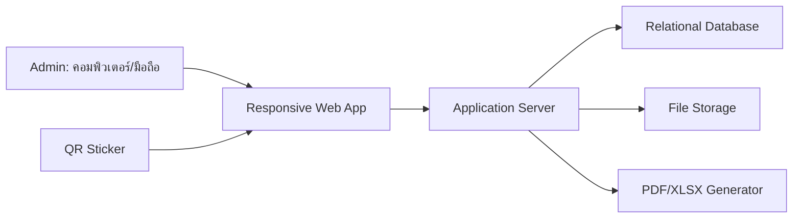
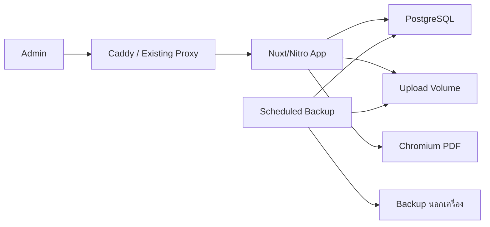

# แผนระบบจัดการครุภัณฑ์ สาขาวิทยาการคอมพิวเตอร์

เวอร์ชัน 1.0 — 17 สิงหาคม 2569  
เอกสารนี้เป็นแหล่งอ้างอิงหลักของโครงการ

## 1. เป้าหมาย

สร้างเว็บแอปพลิเคชันแบบ responsive เพื่อเปลี่ยนทะเบียนครุภัณฑ์จาก Excel/PDF ให้เป็นฐานข้อมูลกลางที่ค้นหาได้ ติดตามประวัติย้อนหลังได้ และรองรับงานต่อไปนี้:

- ทะเบียนครุภัณฑ์
- ยืม–คืน
- แจ้งชำรุดและส่งซ่อม
- ย้ายสถานที่หรือเปลี่ยนผู้รับผิดชอบ
- ตรวจนับประจำปี
- เสนอจำหน่ายและจำหน่ายแล้ว
- นำเข้าข้อมูลจาก Excel/CSV
- ส่งออกรายงาน PDF/Excel

## 2. ขอบเขต MVP

### 2.1 สิ่งที่ระบบต้องมี

1. เข้าสู่ระบบด้วยบัญชี Admin
2. Dashboard สรุปจำนวนและงานค้าง
3. เพิ่ม แก้ไข ค้นหา และดูประวัติครุภัณฑ์
4. แนบรูปและเอกสารกับครุภัณฑ์หรือธุรกรรม
5. สร้างและพิมพ์ QR code รายครุภัณฑ์
6. จัดเก็บข้อมูลผู้ยืม โดยผู้ยืมไม่มีบัญชีระบบ
7. บันทึกยืม คืน และรายการเกินกำหนด
8. บันทึกชำรุด ส่งซ่อม รับกลับ ผลซ่อม และค่าใช้จ่าย
9. บันทึกการย้ายห้องและเปลี่ยนผู้รับผิดชอบ
10. เปิด ปฏิบัติ และปิดรอบตรวจนับประจำปี
11. บันทึกการเสนอจำหน่ายและจำหน่ายแล้ว
12. นำเข้า `.xlsx` หรือ `.csv` ผ่านหน้าตรวจทานก่อนบันทึกจริง
13. ส่งออก PDF และ Excel (`.xlsx`)
14. เก็บ Audit log ของการเปลี่ยนแปลงสำคัญ
15. สำรองและกู้คืนฐานข้อมูลพร้อมไฟล์แนบ

### 2.2 สิ่งที่ยังไม่ทำใน MVP

- บัญชีหรือหน้าขอยืมสำหรับนักศึกษาและบุคลากร
- สิทธิ์หลายบทบาทหรือ workflow อนุมัติหลายขั้น
- แอป iOS/Android แบบ native
- นำเข้าข้อมูลตารางจาก PDF รูปภาพ หรือ OCR
- เชื่อมระบบบัญชี ERP หรือคำนวณค่าเสื่อมราคา
- ลายเซ็นดิจิทัลและการแจ้งเตือนผ่าน LINE/อีเมล

## 3. ผู้ใช้และสิทธิ์

MVP มีบทบาทเดียวคือ **Admin** ซึ่งจัดการทุกโมดูลได้

- สามารถมี Admin มากกว่าหนึ่งบัญชี แต่ทุกบัญชีมีสิทธิ์เท่ากัน
- แยกบัญชีเพื่อระบุใน Audit log ว่าใครทำรายการ
- ผู้ยืมและผู้รับผิดชอบเป็นข้อมูลบุคคลในระบบ แต่เข้าสู่ระบบไม่ได้
- ทุกคำสั่งต้องตรวจ session ฝั่ง server แม้มีเพียงบทบาทเดียว

## 4. แนวทางสถาปัตยกรรม

ใช้เว็บแอปแบบ **modular monolith** เชื่อมฐานข้อมูลเชิงสัมพันธ์และพื้นที่เก็บไฟล์ เหมาะกับผู้ใช้จำนวนน้อย ดูแลง่าย และยังแยกโมดูลชัดเจน



### 4.1 Tool stack

| ส่วน | เครื่องมือ | สถานะ/เหตุผล |
|---|---|---|
| Full-stack web | Nuxt 4 + TypeScript strict | **ยืนยันแล้ว** — ใช้ Pages, Server API และ Nitro ใน repository เดียว ไม่เพิ่ม Express/NestJS |
| Styling | Tailwind CSS 4 | **ยืนยันแล้ว** — ใช้ utility และ design token กลาง |
| UI components | Nuxt UI 4 | **แนะนำ** — ใช้ component ตาราง ฟอร์ม Modal Navigation และ Toast ที่ทำงานร่วมกับ Tailwind เพื่อลดการสร้างเอง |
| Database | PostgreSQL | **แนะนำ** — รองรับ Transaction, Constraint, Decimal, JSON และการสำรองที่เหมาะกับข้อมูลทะเบียน |
| ORM/Migration | Prisma ORM 7 | **แนะนำ** — มี Type-safe client, Migration, Studio และคู่มือใช้งานกับ Nuxt โดยตรง; ไม่ใช้ Prisma Next ที่ยังเป็น Early Access |
| Authentication | `nuxt-auth-utils` | **แนะนำ** — Session cookie และ Password hashing ใน Nuxt; เก็บ session เฉพาะข้อมูลระบุตัว Admin |
| Input validation | Zod 4 | **แนะนำ** — ใช้ Schema เดียวตรวจ Server API และข้อมูลนำเข้า ห้ามเชื่อถือ validation ฝั่งหน้าเว็บอย่างเดียว |
| Package manager | pnpm | **แนะนำ** — ใช้ lockfile และ `--frozen-lockfile` ใน CI/Docker |
| Excel | ExcelJS | **แนะนำ** — อ่าน/สร้าง `.xlsx`; CSV ใช้ parser ที่รองรับ UTF-8 และ streaming |
| PDF | HTML print template + Playwright/Chromium | **แนะนำ** — สร้าง PDF A4 จาก HTML/CSS และฝังฟอนต์ไทย เช่น Sarabun |
| QR | Library ที่สร้าง SVG/PNG เช่น `qrcode` | **แนะนำ** — QR เก็บ URL ที่มี public ID; ทดสอบกับกล้องจริงก่อนพิมพ์จำนวนมาก |
| File storage | Docker volume บนเครื่องระบบ | **แนะนำสำหรับ MVP** — เก็บรูป/เอกสารนอกฐานข้อมูลและรวม volume ในแผน Backup |
| Testing | Vitest + `@nuxt/test-utils` + Playwright | **แนะนำ** — Unit/Integration ด้วย Vitest และ End-to-end ด้วย Browser จริง |
| Code quality | `@nuxt/eslint` | **แนะนำ** — ใช้ Nuxt-aware flat config; ให้ CI รัน lint, typecheck, test และ build |
| Runtime/Deploy | Docker + Docker Compose | **ยืนยันแล้ว** — แยก config Development และ Production และ pin image version |
| HTTPS/Proxy | Caddy หรือ Reverse proxy ของมหาวิทยาลัย | **แนะนำแบบมีเงื่อนไข** — ใช้ของเดิมก่อน; ถ้าไม่มี ใช้ Caddy จัดการ HTTPS และ proxy ไป Nuxt |
| Backup | `pg_dump` + สำรอง upload volume | **จำเป็น** — ตั้งเวลาอัตโนมัติ เก็บนอกเครื่อง และทดสอบ Restore |

หมายเหตุ:

- ใช้ Nuxt เป็นทั้ง Frontend และ Backend สำหรับ MVP ไม่สร้าง API server อีกชุด
- หากใช้ Nuxt UI ให้ใช้การเชื่อม Tailwind ที่มากับโมดูล ไม่ตั้ง Tailwind ซ้ำสองทาง
- Pin เวอร์ชันที่ติดตั้งจริงใน `pnpm-lock.yaml` และ Docker image ไม่ใช้ tag `latest` ใน Production
- ใช้ Native `Intl` สำหรับแสดงวันที่ไทย/พุทธศักราช และเก็บวันจริงใน PostgreSQL; เพิ่ม date library เฉพาะเมื่อมีกรณีที่ Native API ทำไม่ได้

### 4.2 Docker services



Compose สำหรับ Production ควรมี:

1. `app` — Multi-stage build และรัน `.output/server/index.mjs`
2. `db` — PostgreSQL พร้อม named volume และ health check
3. `proxy` — ใช้เมื่อไม่มี reverse proxy เดิม
4. `backup` — งานตามเวลาสำหรับ database dump และไฟล์แนบ หรือใช้ระบบ Backup ภายนอกแทน

ไม่ควรเพิ่ม Redis, Queue, MinIO, Elasticsearch, Microservices หรือ Kubernetes ใน MVP เพราะยังไม่มีปัญหาที่เครื่องมือเหล่านี้ต้องแก้ หากภายหลังการ Import/PDF ใช้เวลานานจน request timeout จึงค่อยเพิ่ม job queue

### 4.3 Quality gate

ทุกครั้งก่อน merge หรือ deploy ต้องผ่าน:

1. `lint`
2. `typecheck`
3. Unit/Integration tests
4. End-to-end tests ของ Login, ยืม–คืน, Import และ Export
5. Production build
6. Database migration check

CI ใช้ GitHub Actions, GitLab CI หรือระบบของมหาวิทยาลัยตามที่ repository รองรับ โดยไม่ต้องติดตั้งระบบ CI แยกเอง

### 4.4 Setup checklist ก่อนเริ่มพัฒนา

#### เครื่องนักพัฒนาและ Repository

- Git repository `cs-asset-management` สร้างแล้วบน branch `main`
- ติดตั้ง Docker Engine/Desktop, Git และ Node.js รุ่น LTS ที่ Nuxt/Prisma รองรับ
- เปิด Corepack และใช้ pnpm เพียง package manager เดียว
- Pin Node/pnpm version ในไฟล์ของโครงการ และ commit `pnpm-lock.yaml`
- เตรียม `.gitignore`, `.dockerignore`, `.editorconfig` และคำสั่ง `lint`, `typecheck`, `test`, `build`
- Local development ให้รัน Nuxt บนเครื่องเพื่อ HMR ที่เร็ว และรัน PostgreSQL ผ่าน Docker; ใช้ Full Compose สำหรับ Integration/Production

#### Environment และ Secret

สร้าง `.env.example` ที่มีเฉพาะชื่อและคำอธิบาย ห้าม commit ค่าจริง โดยอย่างน้อยต้องมี:

- `DATABASE_URL`
- `NUXT_SESSION_PASSWORD` แบบสุ่มและยาวอย่างน้อย 32 ตัวอักษร
- `APP_BASE_URL` สำหรับ URL ใน QR และ callback หลัง Login
- `UPLOAD_DIR` และ `MAX_UPLOAD_SIZE`
- `TZ=Asia/Bangkok` สำหรับการแสดงผล ขณะที่ฐานข้อมูลยังเก็บเวลา UTC
- ค่าที่เกี่ยวกับ Backup และ Reverse proxy ตามสภาพแวดล้อมจริง

แยก Secret ของ Development, Test, UAT และ Production ออกจากกันทั้งหมด

#### Database และข้อมูลตั้งต้น

- สร้าง Prisma schema, migration แรก และคำสั่ง migrate สำหรับ Development/Production แยกกัน
- Seed เฉพาะข้อมูลอ้างอิงที่จำเป็น เช่น หมวด หน่วยนับ ห้อง แหล่งงบ และสถานะ
- สร้างคำสั่งตั้งค่า Admin คนแรกแบบใช้ครั้งเดียว ห้ามฝังรหัสผ่านเริ่มต้นไว้ใน source code หรือ image
- เตรียม Template XLSX/CSV และชุดข้อมูลทดสอบที่ไม่มีข้อมูลส่วนบุคคลจริง
- กำหนดกติกาเลขครุภัณฑ์ การ trim ช่องว่าง ตัวพิมพ์ และการตรวจเลขซ้ำก่อนนำเข้าข้อมูลจริง

#### ไฟล์ รายงาน และ QR

- สร้าง persistent volume สำหรับ Upload และตรวจสิทธิ์อ่าน/เขียนของ container
- เพิ่มฟอนต์ไทยสำหรับ PDF เช่น Sarabun และตรวจใบอนุญาต/การฝังฟอนต์
- กำหนดขนาดไฟล์ ชนิดไฟล์ และนโยบายชื่อไฟล์
- ยืนยัน Domain/`APP_BASE_URL` ก่อนพิมพ์ QR จริงจำนวนมาก; ระหว่างพัฒนาใช้ QR ทดสอบเท่านั้น
- ทดสอบ PDF A4 และสติกเกอร์ QR กับเครื่องพิมพ์/มือถือที่จะใช้งานจริง

#### Production และการปฏิบัติการ

- ยืนยัน Domain, DNS, HTTPS และ Reverse proxy ของมหาวิทยาลัยก่อนตัดสินใจเพิ่ม Caddy
- ไม่เปิด port PostgreSQL ออกสู่ Internet; ให้เข้าถึงได้เฉพาะ network ภายใน Compose/Server
- แยก `compose.yaml` กับ Production override และกำหนด health check/restart policy
- เตรียมพื้นที่ Backup นอกเครื่องระบบ พร้อม retention และคำสั่ง Restore ที่ทดสอบแล้ว
- ตั้ง Log rotation และตรวจพื้นที่ Disk โดยเฉพาะ Upload, PostgreSQL และ Chromium cache
- ทำ CI ให้รัน Quality gate และห้าม deploy หาก Migration/Test/Build ไม่ผ่าน
- เตรียม UAT environment และข้อมูลจำลองก่อนนำข้อมูลจริงขึ้น Production

### 4.5 Git repository และโครงสร้างโครงการ

#### ชื่อและข้อมูล Repository

- ชื่อ Repository/โฟลเดอร์: `cs-asset-management`
- Default branch: `main`
- Visibility: Private/Internal
- คำอธิบาย: `ระบบจัดการครุภัณฑ์ สาขาวิทยาการคอมพิวเตอร์`
- Remote: ใช้ GitHub/GitLab ของมหาวิทยาลัยก่อนบัญชีส่วนตัว หากมี
- ไม่ต้องใช้ Git LFS กับภาพตัวอย่างปัจจุบัน แต่ห้าม commit รูปครุภัณฑ์จริง ไฟล์ Upload, Backup หรือไฟล์รายงานที่ระบบสร้าง

#### โครงสร้างเริ่มต้น

```text
cs-asset-management/
├── app/                    # Nuxt pages, components, layouts, CSS และฟอนต์
├── server/                 # API, middleware, services, repositories
├── shared/                 # Types และ validation schemas ที่ใช้ร่วมกัน
├── prisma/                 # Schema, migrations และ seed
├── public/                 # Static public assets
├── storage/                # Local development only; ไม่ commit
├── tests/                  # Unit, integration และ end-to-end
├── docs/
│   ├── PROJECT_PLAN.md
│   └── references/         # ภาพ/เอกสารตัวอย่างที่ไม่มีข้อมูลลับ
├── compose.yaml
├── compose.production.yaml
├── Dockerfile
├── .env.example
├── .gitignore
├── .dockerignore
├── README.md
└── package.json
```

สร้างเฉพาะโฟลเดอร์ที่ Nuxt/เครื่องมือใช้งานจริง ไม่ต้องสร้างโฟลเดอร์ว่างทั้งหมดล่วงหน้า

#### ไฟล์ที่ต้อง Ignore

- `.env` และ `.env.*` ยกเว้น `.env.example`
- `node_modules/`, `.nuxt/`, `.output/`, `dist/`, coverage และ test artifacts
- `storage/`, `uploads/`, `backups/`, database dumps และไฟล์รายงานที่สร้างแล้ว
- Log, temporary files, editor/OS files
- Playwright browser/cache และ screenshots ที่ไม่ใช่ test fixture

ไฟล์ที่ต้อง commit ได้แก่ Source code, Prisma schema/migrations, Docker/Compose config, Lockfile, Test, Documentation, `.env.example` และฟอนต์ที่ตรวจใบอนุญาตแล้ว

#### ป้องกันปัญหาจากการย้าย Path

- ห้ามใส่ absolute host path ใน Source code, Compose และเอกสารการรัน
- ใช้ path จาก `runtimeConfig`/Environment เช่น `UPLOAD_DIR=/data/uploads`
- ใช้ Docker named volumes แทน bind mount แบบ absolute สำหรับ PostgreSQL และ Production upload
- กำหนดชื่อโครงการ Compose เป็น `cs-asset-management` อย่างชัดเจน เพื่อไม่ให้ชื่อ Volume เปลี่ยนตามชื่อโฟลเดอร์
- ใช้ `APP_BASE_URL` สร้าง URL ใน QR; ห้ามฝัง `localhost` หรือ path เครื่องนักพัฒนา
- Development ใช้ relative path ที่อ้างจาก repository root
- หลังย้ายให้ค้นหา path เดิมทั้ง repository ก่อน commit

#### Initial commits ที่แนะนำ

1. `docs: add project plan and reference documents`
2. `chore: scaffold Nuxt application`
3. `chore: add Docker Compose and PostgreSQL`
4. `chore: configure lint, typecheck and tests`
5. `feat: add database schema and initial admin setup`

แต่ละ commit ต้อง build/test ได้ตามระดับงานของ commit นั้น และไม่รวม Secret หรือข้อมูลจริง

## 5. โมดูลและหน้าจอ

| โมดูล | หน้าจอ/ความสามารถหลัก |
|---|---|
| เข้าสู่ระบบ | Login, logout, เปลี่ยนรหัสผ่าน |
| Dashboard | จำนวนทั้งหมด พร้อมใช้ ถูกยืม เกินกำหนด ชำรุด ซ่อม ไม่พบ และเสนอจำหน่าย |
| ครุภัณฑ์ | รายการ เพิ่ม แก้ไข รายละเอียด Timeline ไฟล์แนบ และ QR |
| บุคคล | ผู้ยืมและผู้รับผิดชอบ |
| ยืม–คืน | กำลังยืม เกินกำหนด รับคืน ยกเลิก และประวัติ |
| ชำรุด/ซ่อม | แจ้งชำรุด ส่งซ่อม รับกลับ ค่าใช้จ่าย และประวัติ |
| ย้าย | ย้ายห้อง เปลี่ยนผู้รับผิดชอบ และประวัติ |
| ตรวจนับ | รอบตรวจ สแกน/ค้นหา รายการยังไม่ตรวจ สรุป และปิดรอบ |
| จำหน่าย | เสนอจำหน่าย หลักฐาน และบันทึกจำหน่ายแล้ว |
| นำเข้าข้อมูล | อัปโหลด Map คอลัมน์ Preview ตรวจข้อผิดพลาด และยืนยัน |
| รายงาน | ตัวกรอง Preview และดาวน์โหลด PDF/XLSX |
| ตั้งค่า | ห้อง หมวด หน่วยนับ แหล่งงบประมาณ และบัญชี Admin |
| Audit log | ค้นหาผู้ทำ เหตุการณ์ รายการ และเวลา |

หน้ารายละเอียดครุภัณฑ์ต้องแสดงข้อมูลปัจจุบันและ Timeline รวมเหตุการณ์ยืม คืน ย้าย ซ่อม ตรวจนับ และจำหน่ายไว้ในหน้าเดียว

## 6. ข้อมูลครุภัณฑ์

### 6.1 ข้อมูลหลัก

- หมายเลขครุภัณฑ์และรหัสภายใน
- ชื่อ หมวด จำนวน และหน่วยนับ
- ยี่ห้อ รุ่น และ Serial number
- วันที่รับ ราคา และแหล่งงบประมาณ
- สถานที่ติดตั้งและผู้รับผิดชอบ
- สถานะ สภาพ หมายเหตุ รูป และไฟล์แนบ

หมายเลขครุภัณฑ์ต้องไม่ซ้ำ หากรายการหนึ่งมีหลายชิ้นและต้องยืมหรือซ่อมแยกชิ้น ต้องแยก record หรือกำหนดรหัสภายในรายชิ้น

### 6.2 สถานะสามมิติ

ห้ามรวมทุกความหมายไว้ใน status เดียว:

| มิติ | ค่า |
|---|---|
| วงจรชีวิต | ใช้งาน, เสนอจำหน่าย, จำหน่ายแล้ว |
| การครอบครอง | พร้อมใช้, ถูกยืม, อยู่ระหว่างซ่อม, ไม่พบ |
| สภาพ | ปกติ, ชำรุดแต่ใช้ได้, ใช้งานไม่ได้ |

ผลตรวจนับเป็นข้อมูลของแต่ละรอบ ไม่เขียนทับประวัติเดิม การพบว่า “ไม่พบ” หรือ “ชำรุด” จะเปลี่ยนสถานะหลักเมื่อ Admin ยืนยันเท่านั้น

## 7. Workflow และกฎธุรกิจ

### 7.1 ยืม–คืน

1. Admin ค้นหาหรือสแกน QR
2. ระบบอนุญาตเฉพาะรายการที่ใช้งานอยู่ พร้อมใช้ และไม่ใช่สภาพใช้งานไม่ได้
3. ระบุผู้ยืม วัตถุประสงค์ วันยืม กำหนดคืน และสภาพก่อนส่งมอบ
4. ยืนยันแล้วระบบสร้างรายการยืมและเปลี่ยนเป็น “ถูกยืม” พร้อมกัน
5. ตอนคืนบันทึกวันคืนและสภาพหลังคืน
6. ถ้าปกติกลับเป็น “พร้อมใช้”; ถ้าเสียหายเปลี่ยนสภาพและเปิดใบแจ้งชำรุดต่อได้

กฎบังคับ:

- หนึ่งครุภัณฑ์มีรายการยืมที่ยังไม่คืนได้ไม่เกินหนึ่งรายการ
- ของที่ถูกยืม ซ่อม ไม่พบ เสนอจำหน่าย หรือจำหน่ายแล้ว ยืมไม่ได้
- รายการเกินกำหนดคือเลยวันกำหนดคืนและยังไม่มีวันคืนจริง

### 7.2 ชำรุด–ซ่อม

1. บันทึกอาการ วันที่ ผู้แจ้ง รูป และหลักฐาน
2. เมื่อส่งซ่อม บันทึกร้าน วันที่ส่ง เลขเอกสาร กำหนดรับ และเปลี่ยนเป็น “อยู่ระหว่างซ่อม”
3. เมื่อรับกลับ บันทึกวัน ผลซ่อม ค่าใช้จ่าย และเอกสาร
4. ซ่อมสำเร็จกลับ “พร้อมใช้”; ซ่อมไม่ได้เปลี่ยนเป็น “ใช้งานไม่ได้” และเสนอจำหน่ายได้

หนึ่งครุภัณฑ์มีงานซ่อมที่ยังไม่ปิดได้ไม่เกินหนึ่งรายการ และห้ามยืมขณะมีงานซ่อมเปิดอยู่

### 7.3 ย้ายสถานที่/ผู้รับผิดชอบ

1. ระบุต้นทาง ปลายทาง ผู้รับผิดชอบเดิม/ใหม่ วันที่ และเหตุผล
2. ระบบเก็บประวัติก่อนเปลี่ยนค่าปัจจุบัน
3. ของที่ถูกยืมต้องรับคืนก่อนย้าย

### 7.4 ตรวจนับประจำปี

1. เปิดรอบตามปีงบประมาณและกำหนดห้อง/ขอบเขต
2. ระบบ snapshot รายการที่ต้องตรวจ ณ วันเปิดรอบ
3. Admin สแกน QR หรือค้นหา แล้วบันทึกสถานที่จริง สภาพ และผลตรวจ
4. ผลตรวจมี พบใช้ได้, พบชำรุด, รอ/ขอซ่อม, ไม่พบ, ขอจำหน่าย และอื่น ๆ
5. รายการที่ยังไม่ตรวจต้องแสดงเป็น “ยังไม่ตรวจ” ไม่ใช่ “ไม่พบ”
6. ก่อนปิดรอบ ระบบแสดงรายการยังไม่ตรวจและรายการผิดปกติ
7. ปิดรอบแล้วล็อกข้อมูล การเปิดแก้ต้องระบุเหตุผลใน Audit log

### 7.5 จำหน่าย

1. สร้างข้อเสนอพร้อมเหตุผลและหลักฐาน แล้วห้ามยืมรายการนั้น
2. เมื่อได้รับอนุมัติ บันทึกวันที่ วิธี และเลขที่เอกสาร
3. เปลี่ยนเป็น “จำหน่ายแล้ว” ซึ่งเป็นสถานะปลายทาง
4. การย้อนกลับทำได้เฉพาะ Admin พร้อมเหตุผลและ Audit log

ธุรกรรมที่เกิดแล้วห้ามลบ ให้ยกเลิกพร้อมเหตุผล ผู้ดำเนินการ และเวลา

## 8. QR code

QR เป็นทางลัดเปิดหน้าครุภัณฑ์ ไม่ใช่ตัวเก็บข้อมูลครุภัณฑ์ทั้งหมด

- QR หนึ่งอันผูกกับครุภัณฑ์หนึ่ง record ผ่าน public ID ที่คาดเดายาก
- ไม่ฝังราคา ผู้รับผิดชอบ หรือข้อมูลสำคัญลงใน QR โดยตรง
- หากยังไม่ login ระบบพาไปหน้า Login แล้วกลับมารายการเดิม
- หลังสแกนแสดงหมายเลข ชื่อ รูป ห้อง ผู้รับผิดชอบ สถานะ สภาพ และ Timeline
- ปุ่มงานด่วนเปลี่ยนตามสถานะ เช่น ยืม รับคืน แจ้งชำรุด ส่งซ่อม ย้าย และตรวจนับ
- ติดกับรายการที่ติดตามรายชิ้นได้; วัสดุสิ้นเปลืองไม่ต้องติด
- สติกเกอร์ต้องมีหมายเลขที่อ่านด้วยตาได้ เผื่อ QR ชำรุด
- พิมพ์สติกเกอร์ซ้ำต้องใช้ QR เดิมและไม่สร้างครุภัณฑ์ใหม่

## 9. โครงสร้างฐานข้อมูลหลัก

| ตาราง | หน้าที่ |
|---|---|
| `users` | บัญชี Admin |
| `assets` | ข้อมูลทะเบียนและสถานะปัจจุบัน |
| `asset_events` | Timeline เหตุการณ์รายครุภัณฑ์ |
| `people` | ผู้ยืมและผู้รับผิดชอบ |
| `locations`, `categories`, `units`, `funding_sources` | ข้อมูลอ้างอิง |
| `loans` | ยืม–คืน |
| `repair_jobs` | แจ้งชำรุดและซ่อม |
| `transfers` | ย้ายสถานที่/ผู้รับผิดชอบ |
| `inspection_rounds`, `inspection_items` | รอบและผลตรวจนับ |
| `disposals` | เสนอและบันทึกจำหน่าย |
| `attachments` | Metadata และตำแหน่งไฟล์ |
| `import_batches`, `import_rows` | ประวัติและ staging การนำเข้า |
| `audit_logs` | ผู้ทำ การเปลี่ยนแปลงก่อน/หลัง และเวลา |

ข้อกำหนดสำคัญ:

- ราคาใช้ Decimal ไม่ใช้ Float
- วันแสดงเป็น พ.ศ. แต่ฐานข้อมูลเก็บแบบ Gregorian/ISO
- เวลาเก็บเป็น UTC และแสดงตาม Asia/Bangkok
- ไฟล์เก็บใน file/object storage ฐานข้อมูลเก็บ metadata
- ข้อมูลอ้างอิงที่ถูกใช้แล้วให้ปิดใช้งาน ไม่ลบ
- การเปลี่ยนธุรกรรมและสถานะต้องอยู่ใน database transaction เดียว

## 10. นำเข้า Excel/CSV

### 10.1 รูปแบบที่รับ

- Excel `.xlsx` โดยไม่รับ Macro
- CSV `.csv` แบบ UTF-8 รองรับ comma, semicolon หรือ tab
- ไม่รับ `.xls`, PDF, รูปภาพ หรือไฟล์ executable เป็นข้อมูลตาราง

PDF/ภาพเดิมแนบเป็นหลักฐานได้ แต่ไม่อ่านเข้าทะเบียนอัตโนมัติ

### 10.2 ขั้นตอน

1. อัปโหลดและตรวจชนิด/ขนาดไฟล์
2. เลือก Sheet หากเป็น Excel
3. Map หัวคอลัมน์เดิมกับฟิลด์ระบบ
4. แปลงวันที่ พ.ศ./ค.ศ. ราคา จำนวน และข้อความ
5. Preview ทุกแถวก่อนบันทึกจริง
6. แยกเป็น พร้อมนำเข้า, ข้อมูลผิด, ซ้ำในไฟล์ และซ้ำในระบบ
7. ดาวน์โหลดรายการผิดไปแก้หรือข้ามแถว
8. ยืนยันแล้วนำเข้าเฉพาะแถวที่ผ่าน พร้อมเก็บ Batch สำหรับตรวจย้อนหลัง
9. สรุปจำนวนสำเร็จ ข้าม และผิดพลาด

คอลัมน์ขั้นต่ำ: หมายเลข ชื่อ วันที่รับ ราคา จำนวน หน่วยนับ สถานที่ และหมวด

## 11. ส่งออก PDF/Excel

### 11.1 หลักการ

- ส่งออกตามตัวกรองที่แสดงบนหน้าจอ
- PDF ใช้สำหรับพิมพ์/ลงนาม ขนาด A4 และฝังฟอนต์ไทย
- Excel ใช้ `.xlsx` และเก็บวันที่/ตัวเลขเป็นชนิดข้อมูลที่คำนวณต่อได้
- แสดงวันเวลา ผู้จัดทำ และเงื่อนไขตัวกรอง
- จำนวนรายการและยอดมูลค่าต้องตรงกันระหว่างหน้าจอ PDF และ Excel

### 11.2 รายงาน MVP

1. ทะเบียนครุภัณฑ์ทั้งหมดหรือแยกตามห้อง หมวด และปีงบประมาณ
2. รายการยืมอยู่ เกินกำหนด และประวัติยืม–คืน
3. รายการชำรุด กำลังซ่อม ประวัติและค่าใช้จ่ายซ่อม
4. ประวัติย้ายสถานที่
5. ผลตรวจนับประจำปีและรายการผิดปกติ
6. รายการเสนอจำหน่ายและจำหน่ายแล้ว
7. ประวัติครุภัณฑ์รายชิ้น

รายงานรอบตรวจที่ปิดแล้วต้องสร้างซ้ำได้ผลเดิม แม้สถานะปัจจุบันของครุภัณฑ์เปลี่ยนภายหลัง

## 12. ความปลอดภัยและความน่าเชื่อถือ

- Hash รหัสผ่านด้วยมาตรฐานที่เหมาะสม เช่น Argon2id
- Session cookie ต้องเป็น HttpOnly, Secure และกำหนด timeout
- ป้องกัน CSRF, SQL injection, XSS และ brute-force login
- QR ใช้ ID ที่คาดเดายากและยังต้อง login
- จำกัดชนิด ขนาด และชื่อไฟล์แนบ
- ไม่เก็บรหัสผ่าน Token หรือข้อมูลลับใน log/source code
- Audit log อ่านได้แต่แก้จากหน้าจอไม่ได้
- สำรองฐานข้อมูลและไฟล์แนบอัตโนมัติทุกวัน
- เก็บอย่างน้อย 7 daily และ 4 weekly backups หรือปรับตามพื้นที่จริง
- ทดสอบกู้คืนก่อนเปิดใช้งานและเป็นระยะ

## 13. แผนพัฒนา

### ระยะ 0 — ยืนยันข้อมูลจริง

- รวบรวม Excel/CSV และตัวอย่างเอกสารยืม ซ่อม ตรวจนับ และจำหน่าย
- ยืนยันชื่อฟิลด์ รูปแบบเลขครุภัณฑ์ และรายงาน
- ยืนยัน Server, Domain, HTTPS, Storage และ Backup

ผลลัพธ์: Requirement ที่ยืนยันแล้ว, Import template และตัวอย่างรายงาน

### ระยะ 1 — แกนระบบและทะเบียน

- Login, Database migration และหน้าหลัก
- ข้อมูลอ้างอิง ทะเบียน ค้นหา รายละเอียด ไฟล์แนบ และ Audit log
- Import XLSX/CSV และ Export ทะเบียน PDF/XLSX

ตรวจผ่าน: นำเข้าข้อมูลทดลองและเทียบจำนวน/มูลค่ากับไฟล์เดิมได้ตรงกัน

### ระยะ 2 — QR และงานประจำวัน

- QR และหน้าจอมือถือ
- ข้อมูลบุคคล ยืม–คืน เกินกำหนด
- ชำรุด/ซ่อม ย้าย และ Timeline
- Dashboard

ตรวจผ่าน: ยืม คืนแบบเสียหาย ส่งซ่อม รับกลับ และย้ายได้ครบ end-to-end

### ระยะ 3 — ตรวจนับ จำหน่าย และรายงาน

- รอบตรวจ Snapshot สแกน QR และปิดรอบ
- เสนอ/บันทึกจำหน่าย
- รายงาน PDF/Excel ทั้งชุด

ตรวจผ่าน: รายงานได้รับการยืนยันและยอดตรงฐานข้อมูล

### ระยะ 4 — เปิดใช้งานจริง

- ทดสอบความปลอดภัย ประสิทธิภาพ และแก้ข้อบกพร่อง
- ทดสอบ Backup/Restore
- นำเข้าข้อมูลจริงและตรวจยอด
- จัดทำคู่มือ Admin อบรม และ Deploy

ตรวจผ่าน: UAT และ Restore ผ่าน ไม่มีข้อผิดพลาดระดับร้ายแรง

## 14. การทดสอบสำคัญ

1. หมายเลขครุภัณฑ์ซ้ำถูกปฏิเสธทั้งหน้าเพิ่มและนำเข้า
2. ยืมพร้อมกันสองคำขอสำเร็จได้เพียงรายการเดียว
3. ของที่ยืมหรือซ่อมอยู่ยืมซ้ำไม่ได้
4. คืนแบบชำรุดแล้วเปิดงานซ่อมต่อได้และประวัติไม่หาย
5. ซ่อมสำเร็จ/ไม่สำเร็จเปลี่ยนสถานะถูกต้อง
6. ย้ายแล้วเห็นทั้งสถานที่ปัจจุบันและประวัติเดิม
7. รายการยังไม่ตรวจไม่ถูกนับเป็น “ไม่พบ”
8. รอบตรวจที่ปิดแล้วไม่เปลี่ยนตามทะเบียนปัจจุบัน
9. QR ที่ยังไม่ login ไม่เปิดเผยรายละเอียด
10. XLSX/CSV ภาษาไทย วันที่ พ.ศ. ราคา และเลขที่มี `/.-` นำเข้าได้
11. แถวข้อมูลผิดไม่หลุดเข้าทะเบียนจริง
12. PDF/Excel มีจำนวนและยอดตรงหน้าจอ
13. การแก้ไข/ยกเลิกปรากฏใน Audit log
14. กู้ Backup แล้วจำนวนข้อมูลและไฟล์แนบครบ

## 15. เกณฑ์รับมอบ

ระบบผ่านเมื่อ:

- Admin ใช้งานโมดูลในขอบเขตได้ครบ
- ค้นหาด้วยหมายเลข ชื่อ Serial ห้อง และผู้รับผิดชอบได้
- QR เปิดครุภัณฑ์ถูกชิ้นและแสดงปุ่มตามสถานะ
- Workflow ยืม คืน ซ่อม ย้าย ตรวจนับ และจำหน่ายทำงานตามกฎ
- Import มี Preview, Validation, Batch และไม่บันทึกแถวผิด
- Export PDF/Excel ครบและยอดถูกต้อง
- Timeline และ Audit log ตรวจย้อนหลังได้
- ใช้งานภาษาไทยและวันที่ พ.ศ. ได้ถูกต้อง
- Backup/Restore และการตรวจยอดหลังย้ายข้อมูลผ่าน
- ไม่มีข้อผิดพลาดระดับ Blocker/Critical ก่อนเปิดใช้งาน

## 16. ความเสี่ยงหลัก

| ความเสี่ยง | วิธีลดความเสี่ยง |
|---|---|
| Excel เดิมซ้ำหรือข้อมูลไม่ครบ | Staging, Validation, Preview และตรวจยอดก่อนนำเข้าจริง |
| แบบฟอร์มยืม/ซ่อม/จำหน่ายยังไม่ชัด | ยืนยันตัวอย่างจริงก่อนสร้างโมดูล |
| หลายชิ้นใช้หมายเลขเดียว | แยก Record/รหัสภายในก่อนติด QR |
| QR หลุดหรือเสียหาย | พิมพ์หมายเลขให้อ่านได้และค้นหาสำรองได้ |
| PDF ภาษาไทยเพี้ยน | ฝังฟอนต์และทดสอบไฟล์จริง |
| Admin ลืมรหัสผ่าน | กำหนดขั้นตอนกู้บัญชีที่ปลอดภัย |
| Server หรือ Disk เสีย | สำรองแยกตำแหน่งและทดสอบกู้คืน |
| สถานะกับประวัติไม่ตรง | ใช้ Transaction, Constraint และ Integration test |

## 17. สิ่งที่ต้องยืนยันก่อนเริ่มพัฒนา

1. เทคโนโลยีและผู้ดูแลระบบต่อ
2. Server, Domain, HTTPS และพื้นที่ไฟล์
3. ตัวอย่าง Excel/CSV จริงพร้อมชื่อคอลัมน์
4. แบบฟอร์มยืม–คืน ซ่อม จำหน่าย และรายงานที่ใช้จริง
5. รูปแบบและขนาดสติกเกอร์ QR
6. จำนวนบัญชี Admin
7. กติกาของรายการไม่มีเลข เลขซ้ำ หรือรายการรวมหลายชิ้น
8. รูปแบบหัวกระดาษ ผู้ลงนาม และเลขเอกสารใน PDF
9. อายุการเก็บ Audit log ไฟล์แนบ และ Backup
10. วันเริ่มปีงบประมาณและกฎการเปิดแก้รอบตรวจ
