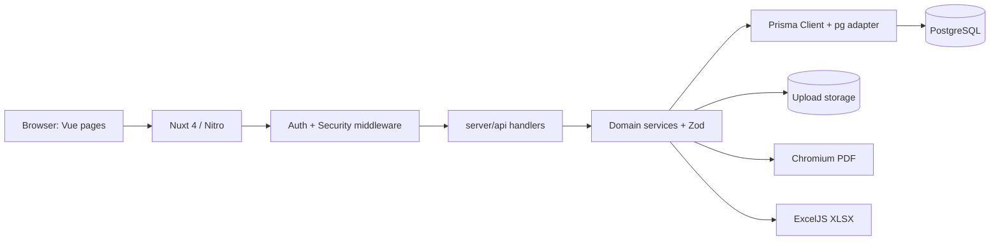
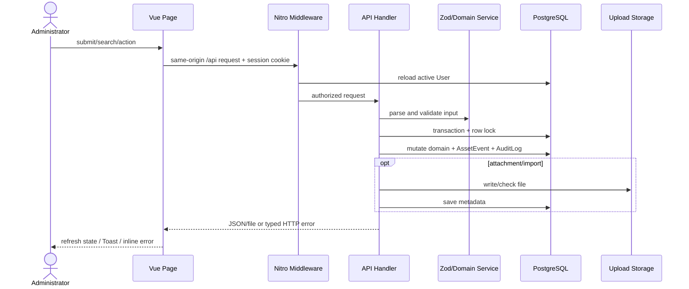
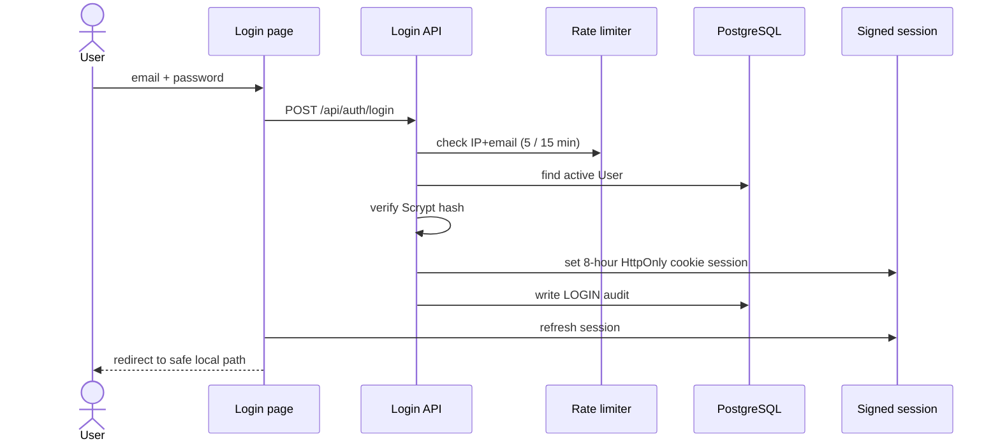
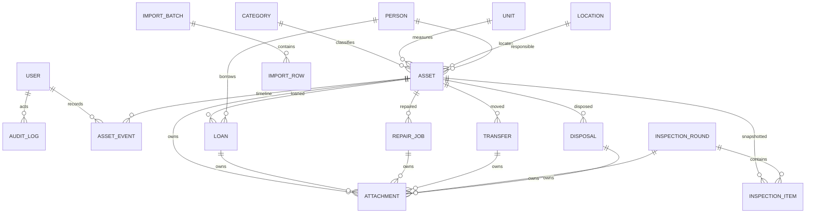
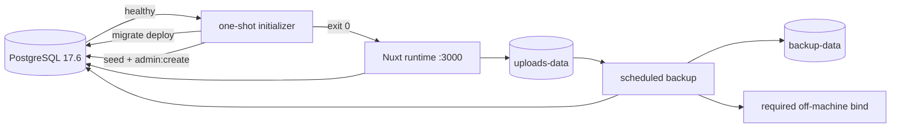

# System Architecture

## Architectural Intent

ระบบใช้ **Nuxt modular monolith**: UI, server-rendered application และ Nitro API อยู่ repository/deployment เดียว เชื่อม PostgreSQL และ local persistent uploads โดยตรง (`nuxt.config.ts`, `server/`, `prisma/`). การแยกเป็น microservices จะเพิ่ม deployment และ consistency cost โดยไม่มี boundary ใน Source Code รองรับ แนวทางที่เล็กและตรงระบบปัจจุบันที่สุดจึงเป็น monolith เดิม พร้อมเอกสารสองฉบับแยกมุมมองผู้ใช้กับเทคนิค



## Technology Stack

| Layer | Technology ที่พบ |
|---|---|
| Application | Nuxt 4.5.2, Vue 3, Nitro, TypeScript strict |
| UI | Nuxt UI 4.10, Tailwind utilities, Lucide Iconify bundle, Noto Sans Thai, light/dark mode |
| Validation/Auth | Zod 4, `nuxt-auth-utils`, Scrypt hashing จาก `@adonisjs/hash` |
| Data | PostgreSQL, Prisma 7.9.1, `@prisma/adapter-pg`, `pg` |
| Files/Import/Export | Node filesystem, csv-parse, ExcelJS, qrcode, Playwright Core/Chromium |
| Quality | ESLint 9, vue-tsc, Vitest, Playwright |
| Runtime | Node >=22, pnpm 11.18, Docker multi-stage, Docker Compose, GitHub Actions |

เวอร์ชันอ้างอิงจาก `package.json:5-54`; strict/type checking และ runtime config อยู่ที่ `nuxt.config.ts:1-43`

## Project Structure และ Dependency Direction

```text
app/                 Vue pages, layouts, shared UI, composables, global client middleware
server/api/          Nitro route handlers ตาม HTTP method
server/services/     workflow rules, import, report, attachment logic
server/utils/        Prisma, session, audit, pagination/sort, rate limit helpers
server/middleware/   global API authentication and security headers/origin checks
shared/schemas/      Zod contracts used across application layers
shared/types/        domain status constants/types and session augmentation
prisma/              schema, migrations, idempotent reference seed
tests/unit/          schema/service tests in Nuxt Vitest environment
tests/e2e/           database-backed Playwright journeys/regressions
scripts/             init, admin provisioning, backup, restore, restore drill
```

Dependency หลักคือ `page → same-origin API → schema/service → Prisma/filesystem`; handler เป็น transaction boundary ของ business workflow ไม่มี separate repository/domain layer ซึ่งเหมาะกับขนาดปัจจุบัน แต่ทำให้ business rules บางส่วนกระจายใน route handlers

## Request และ Data Flow



List API ใช้ page/pageSize, endpoint-specific `where`, whitelist sort และ deterministic tie-breaker (`server/utils/request.ts:16-34`). UI debounce query 300 ms และ reset page เมื่อ filter/sort เปลี่ยน (`app/composables/useResourceList.ts:17-73`)

## Authentication Flow



Client middleware redirect ผู้ไม่มี session ไป `/login` (`app/middleware/auth.global.ts:1-7`). Server เป็น enforcement จริง: ทุก API ยกเว้น Login/Health เรียก active-user check (`server/middleware/auth.ts:1-7`). Cookie เป็น HttpOnly, SameSite=Lax, Secure ตาม environment; production บังคับ Secure (`nuxt.config.ts:23-31`, `compose.production.yaml:9-15`)

## Domain และ Database Architecture



โมเดลทั้งหมดอยู่ใน `prisma/schema.prisma:89-525`. ใช้ UUID primary key; Asset, InspectionRound และ ImportBatch มี public CUID เพิ่ม ความสัมพันธ์ส่วนใหญ่ `onDelete: Restrict` เพื่อรักษาประวัติ Attachment ใช้ nullable foreign key หกชุด และ CHECK บังคับให้มี owner เพียงชนิดเดียว (`prisma/schema.prisma:434-459`, `prisma/migrations/20260817194000_init/migration.sql:665-669`)

Migration เพิ่ม partial unique index ให้ครุภัณฑ์หนึ่งชิ้นมี Loan `ACTIVE`, Repair `REPORTED/SENT` และ Disposal `PROPOSED` ได้อย่างละไม่เกินหนึ่ง พร้อม CHECK สำหรับ quantity/price, วันที่ยืม, terminal fields, inspection pairing, attachment owner เพียงหนึ่ง และ counters (`prisma/migrations/20260817194000_init/migration.sql:617-674`). อย่างไรก็ตาม DB ไม่บังคับ cross-table state เช่น Active Loan ต้องคู่กับ Asset `BORROWED`; consistency ส่วนนี้พึ่ง API transaction

### Transaction Pattern

Mutating workflow โดยทั่วไปทำดังนี้:

1. Parse body ด้วย Zod
2. `SELECT ... FOR UPDATE` record หลัก
3. ตรวจ transition จาก state ปัจจุบัน
4. update workflow และ Asset
5. append AssetEvent และ AuditLog
6. commit/rollback พร้อมกัน

ตัวอย่างครบเส้นทางอยู่ที่ Loan create (`server/api/loans/index.post.ts:9-29`), Repair send (`server/api/repairs/[id]/send.post.ts:7-21`) และ Disposal complete (`server/api/disposals/[id]/complete.post.ts:7-18`). Transfer reverse ใช้ compensating record ส่วน InspectionRound เก็บ snapshot จึงรักษาประวัติแม้ Asset ปัจจุบันเปลี่ยน

## Import, File และ Report Architecture

- Import parser แปลง XLSX/CSV เป็น row กลาง, normalize ค่าไทย, validate ด้วย Asset schema แล้ว persist `ImportBatch/ImportRow`; confirm lock batch และใช้ `createMany(skipDuplicates)` (`server/services/import-parser.ts`, `server/api/imports/`)
- Attachment เขียนไฟล์แบบ randomized path, ตรวจ signature/checksum แล้วบันทึก owner metadata; หาก DB ล้มเหลวมี compensating unlink แต่ filesystem กับ DB ไม่ใช่ distributed transaction (`server/services/attachments.ts:54-96`)
- Report รวม query parsing และ data builder ชุดเดียวสำหรับ preview/PDF/XLSX ป้องกัน filter drift (`shared/schemas/report.ts`, `server/services/reports.ts`). PDF launch Chromium ใหม่ต่อคำขอ; XLSX สร้างใน memory

## UI/UX Architecture

Authenticated layout ใช้ sidebar desktop และ drawer/top bar mobile (`app/layouts/default.vue:21-35`). UI ใช้ Tailwind classes ใน template, input/select สูง 44px และฟอนต์ไทยจาก local package (`app/assets/css/main.css:1-21`). Theme teal/slate กำหนดกลางใน `app/app.config.ts`; Lucide icons bundle ทั้ง client/server ใน `nuxt.config.ts:5-19`

`ResourceList` เป็น reusable table controller สำหรับ search/filter/sort/pagination/action/attachment ขณะที่ form workflow หลายชนิดแชร์ dynamic page `app/pages/workflows/[type]/create.vue`. UI ไม่ disable action; handler ตรวจเงื่อนไขและ Toast เหตุผล การแสดงวันที่ใช้ปฏิทินพุทธและ timezone Bangkok (`app/composables/useThaiDate.ts:2-16`)

## Security Controls

- Scrypt password hash; generic bad-credential response; active-user recheck ทุก API
- Signed server session, 8 ชั่วโมง, HttpOnly/SameSite, production Secure
- in-memory rate limit ต่อ IP+email, 5 ครั้ง/15 นาที, สูงสุด 5,000 keys
- reject mutating request ที่มี Origin ไม่ตรง configured origin
- `nosniff`, frame deny, same-origin referrer, camera self; API `Cache-Control: no-store`
- Zod validation, parameterized Prisma queries, row locks และ DB constraints
- Attachment whitelist + extension/signature + SHA-256; randomized stored names; download ป้องกัน path escape
- Audit/AssetEvent สำหรับ mutation สำคัญ

ไม่พบ CSP/HSTS ใน app; HSTS อาจอยู่ reverse proxy แต่ยืนยันไม่ได้ Rate limit เป็น process-local จึง reset เมื่อ restart และไม่แชร์ระหว่าง replicas (`server/utils/login-rate-limit.ts:3-40`)

## Build, Run และ Deployment

### Local host

ต้องใช้ Node >=22 และ pnpm 11.18 (`package.json:5-8`). คำสั่งหลักคือ `pnpm dev`, `build`, `lint`, `typecheck`, `test`, `test:e2e`, `db:migrate`, `db:deploy`, `db:seed`, `admin:create`

### Docker Compose



Dockerfile มี dependency, build, initializer และ non-root runtime stages; runtime ติด Chromium/ฟอนต์ไทย (`Dockerfile:1-49`). การมี image `app` และ `init` สองตัวเป็นความตั้งใจ: init เก็บ tooling เพื่อ migrate/seed/create admin ส่วน app เก็บเฉพาะ `.output`. App เริ่มเมื่อ init สำเร็จ (`compose.yaml:4-42`, `scripts/docker-init.sh:4-6`)

Production overlay เอา published ports ออกและ expose app ภายใน จึงต้องมี HTTPS reverse proxy ภายนอกที่ repository ไม่ได้กำหนด (`compose.production.yaml:9-26`). Backup dump DB + tar uploads + SHA-256 รายวัน/รายสัปดาห์และบังคับ replica; restore เป็น tools profile ที่ล้าง DB/uploads เดิม (`scripts/backup.sh`, `scripts/restore.sh`)

## Testing และ CI

- Vitest ใช้ Nuxt environment; มี unit tests สำหรับ Zod/domain normalization, import parser, attachment signature และ workflow rules แต่ไม่มี coverage threshold (`vitest.config.ts:3-7`)
- Playwright มี 3 end-to-end scenarios ครอบคลุม Login, CRUD หลัก, attachment, pagination/search/sort/filter, concurrent loan/import/disposal, workflow correction, inspection snapshot, reports และการ render reference ใน Settings (`tests/e2e/system.e2e.ts`, `tests/e2e/regressions.e2e.ts`); ยังไม่ครอบคลุม create/toggle admin, เปลี่ยนรหัสผ่าน หรือ mutation ของ reference
- Browser matrix มีเฉพาะ Desktop Chromium (`playwright.config.ts:5-26`)
- GitHub Actions quality job รัน lint → typecheck → unit → Prisma validate/migrate/seed → build บน PostgreSQL 16; E2E job สร้าง admin, ทำ restore drill และรัน Playwright (`.github/workflows/ci.yml:12-102`)
- ไม่มี deployment/CD workflow และ CI ไม่ build Docker/Compose topology

## Technical Debt และข้อเสนอแนะจาก Scrutinize

| ระดับ | สิ่งที่พบและผลกระทบ | การแก้ที่เล็กที่สุด |
|---|---|---|
| Major | ไม่มี RBAC; active User ทุกคนจัดการผู้ดูแล/รายงาน/Audit/workflow ได้ | เพิ่ม role/permission matrix ก่อนขยายกลุ่มผู้ใช้ |
| Major | Dashboard UI รอ collection ที่ API ไม่ส่ง จึงมีสอง panel ว่างถาวร | ส่ง pending/events จริง หรือลบ panel |
| Major | `.env.example` ปัจจุบันใช้ DB URL port 5432 แต่ `POSTGRES_PORT=5435`; host Nuxt ต่อ Compose DB ไม่ได้เมื่อ copy ตรง ๆ | ทำ port ทั้งสองค่าให้สอดคล้องหรือประกอบ DATABASE_URL จากตัวแปรเดียว |
| Major | เปลี่ยน password ล้าง session แต่ UI ไม่ redirect | ใช้ `loginRequired` แล้วไป `/login` |
| Major | Inspection detail โหลด item ทั้งรอบ; report โหลด dataset ทั้งหมด และ PDF เปิด Chromium ต่อคำขอ | ใช้ server pagination; จำกัด/queue export ขนาดใหญ่ |
| Major | QR ใช้ publicId ซึ่ง GET detail รองรับ แต่ edit/workflow downstream คาด UUID | resolve เป็น `asset.id` ก่อนสร้าง link หรือให้ mutation endpoints รองรับ publicId อย่างสม่ำเสมอ |
| Major | UI return/repair close ส่งค่าปกติ/สำเร็จคงที่ แม้ API รองรับ branch ผิดปกติและค่าใช้จ่าย | เพิ่ม dialog/form รับสภาพ ผลซ่อม หมายเหตุและ cost ก่อนส่ง |
| Moderate | query enum/UUID validation ไม่สม่ำเสมอ และ Zod max length บางค่าเกิน DB column | เพิ่ม shared query/UUID schemas และ align limits |
| Moderate | AuditLog มี IP/User-Agent แต่ writer ไม่บันทึก; reference mutations ไม่ transaction กับ audit | ส่ง request metadata และห่อ mutation+audit ใน transaction |
| Moderate | Import ตรวจ extension แต่ไม่ตรวจ signature เหมือน attachment; ไม่มี cleanup/cancel | reuse file validation และเพิ่ม lifecycle cleanup |
| Moderate | Health ไม่ตรวจ DB/storage; Compose health เรียก `/` | เพิ่ม readiness endpoint ที่ probe dependencies |
| Moderate | Restore DB ก่อนแทน uploads จึงไม่ atomic และ app-stop เป็นขั้นตอน manual | restore ไป staging แล้วสลับ หรือ automate maintenance mode |
| Moderate | CI PostgreSQL 16 แต่ deployment 17.6; ไม่มี Docker smoke test | align version และเพิ่ม image/compose test |
| Moderate | initializer seed ทุกครั้งและ upsert ทับ name/sort/isActive ของ reference มาตรฐาน | แยก bootstrap seed ออกจาก reconciliation หรือไม่ update operator-managed fields |
| Minor | `lastLoginAt`, repair `reporterId`, import FAILED/CANCELLED/SKIPPED ยังไม่มี flow ใช้งาน | ลบ field ที่ไม่ใช้หรือ implement lifecycle ให้ครบ |

ข้อสังเกตเพิ่มเติม: security headers ยังไม่มี CSP/HSTS, backup health ไม่มี alert destination, restore drill ตรวจเพียงบาง table, ไม่มี automated rate-limit/origin/security-header tests และ reference ที่ inactive บางชนิดยังถูกส่งเข้า operational selectors

## สิ่งที่ไม่สามารถยืนยันได้

Repository ไม่มีหลักฐานของ reverse proxy/TLS/domain จริง, secret manager, network policy, DB privileges, replica count, monitoring/alerting, production RPO/RTO, off-machine storage implementation, antivirus, scheduled deployment หรือผล performance/load test ดังนั้นส่วนเหล่านี้ต้องตรวจ environment จริงก่อน production acceptance
